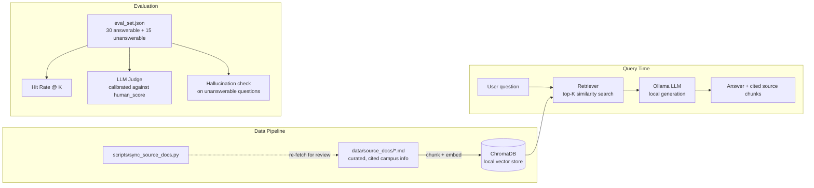

# Canvasllamaindex — Local Berkeley Campus Assistant

[](https://github.com/Vincentlu1412/Canvasllamaindex/actions/workflows/ci.yml)
[](LICENSE)
[](https://www.python.org/)

A fully local RAG (Retrieval-Augmented Generation) assistant that answers
questions about UC Berkeley campus services — Cal 1 Card, libraries, dining,
health services, tech support, transportation, and more — grounded in real
official-site content, running entirely on your own machine.

**Stack:** [LlamaIndex](https://www.llamaindex.ai/) for retrieval/orchestration,
[ChromaDB](https://www.trychroma.com/) as the local vector store,
[Ollama](https://ollama.com/) for a fully local LLM, and
[Streamlit](https://streamlit.io/) for the UI. No API keys, no cloud calls,
no data leaving your machine.

---

## Why this exists

Campus information at a large university is scattered across dozens of
independently-run websites (housing, dining, libraries, tech services,
health services, ...) with inconsistent search and no single place to just
*ask a question*. This project explores whether a small local RAG stack —
no OpenAI key, no cloud vector DB — can answer real student questions
accurately, with citations, and **know when it doesn't know**.

That last part is the interesting engineering problem. A campus assistant
that confidently states a wrong deadline or a made-up phone number is worse
than useless. So the evaluation harness in this repo is built specifically
to catch that failure mode, not just to measure "does it sound right."

## Features

- 🔍 **Local RAG pipeline** — Markdown source docs are chunked, embedded
  with a local HuggingFace model (`BAAI/bge-small-en-v1.5` by default), and
  stored in a persistent ChromaDB collection. Retrieval + generation both
  run through a local Ollama model — nothing is sent to a third-party API.
- 📎 **Cited answers** — every response shows the retrieved source chunks
  and their similarity scores, so an answer can be checked against the
  actual source text instead of taken on faith.
- 🧪 **A real evaluation harness**, not just a demo:
  - **Hit Rate@K** — did retrieval actually find the chunk tagged as the
    correct source for a given question?
  - **LLM-judge correctness scoring**, gated behind a **calibration step**:
    the judge is first checked against a hand-scored subset
    (`human_score` in `eval_set.json`) and its scores are hidden from the
    rest of the eval set until it agrees with humans often enough. This
    avoids the classic "the same model family grades its own homework"
    trap.
  - **Hallucination rate** — a dedicated set of questions the knowledge
    base *can't* answer (live data, per-student private data, subjective
    opinions, future events) checks whether the assistant appropriately
    declines instead of fabricating a confident-sounding answer.
- 🔄 **Repeatable data pipeline** — `scripts/sync_source_docs.py` re-fetches
  the configured official pages so source docs can be refreshed instead of
  going stale silently.
- 🎓 **Optional personal Canvas integration** — connect your own Canvas
  courses with a personal access token to ask about your assignments and
  deadlines. Personal data is indexed in memory in a *separate* index from
  the public knowledge base, never persisted to disk, never committed.

## A real bug this project already found (and fixed)

Early on, the evaluation set had a silent data-leakage problem: `ground_truth`
answers were verbatim copies of the source docs, and the source docs had the
eval questions' exact wording baked into them (`"Where can I find X? X is
..."`). That meant retrieval was matching *question against question*
instead of *question against answer content*, and the LLM judge was scoring
"did it copy the text back correctly," not "did it understand and answer
correctly." Both metrics were quietly inflated.

The fix — paraphrasing `ground_truth`, rewriting source docs to be purely
declarative, and adding 15 "the knowledge base can't answer this" questions
to measure hallucination — is now pinned down as regression tests in
[`tests/test_eval_set.py`](tests/test_eval_set.py), run on every push via
GitHub Actions. It's a good example of why an eval harness needs its own
tests: a leaky benchmark will happily tell you your RAG pipeline is great
right up until a real user asks it something.

## Architecture



## Quickstart

**Prerequisites:**
- Python 3.11+
- [Ollama](https://ollama.com/) installed and running locally

```bash
# 1. Install dependencies
pip install -r requirements.txt

# 2. Pull a local model (default is qwen2.5:3b-instruct — small enough to
#    run on a laptop; swap via OLLAMA_MODEL for something bigger)
ollama pull qwen2.5:3b-instruct

# 3. Run the app
streamlit run hello_streamlit.py
```

The first run builds the vector index from `data/source_docs/` — this
takes a minute. Subsequent runs reuse the persisted ChromaDB collection in
`chroma_db/` (gitignored, regenerated locally). If you edit the source docs
and want to force a rebuild, set `FORCE_REINDEX=1`:

```bash
FORCE_REINDEX=1 streamlit run hello_streamlit.py
```

### Optional: connect your own Canvas courses

The assistant can additionally answer questions about **your own** Canvas
(bCourses) courses — assignments, due dates, announcements — alongside the
public campus knowledge base.

This uses a **personal access token**, which is the only officially
supported way to reach the Canvas API. It is not your password, it only
grants access to data your own account can already see, and you can revoke
it at any time.

1. In Canvas, go to **Account → Settings → Approved Integrations →
   "+ New Access Token"**. Give it a purpose and (recommended) a short
   expiry date. Copy the token — Canvas only shows it once.
2. `cp .env.example .env` and fill in:
   ```bash
   CANVAS_BASE_URL=https://bcourses.berkeley.edu   # your school's Canvas host
   CANVAS_API_TOKEN=<the token you just generated>
   ```
   Your Canvas host must match where you generated the token — Canvas is
   multi-tenant, and every school runs its own instance
   (`bcourses.berkeley.edu`, `ucommons.instructure.com`,
   `canvas.<school>.edu`, ...). There is intentionally no default.
3. Restart the app. A **"Public campus info" / "My Canvas courses"** toggle
   appears above the question box.

**How your data is handled:**
- Personal Canvas data is indexed **in memory only**. It is never written
  to `chroma_db/` alongside the public docs, so it can't be committed by
  accident and can't go stale on disk.
- It lives in a **separate index** from the public knowledge base, so a
  question about library hours can never accidentally retrieve your grades.
- `.env` is gitignored. The token is never logged; the developer panel
  shows only the Canvas *host*, never the token.
- Everything still runs locally — your course data goes to your local
  Ollama model, not to any third-party API.

> **Never put a token (or a password) directly in code, in a commit, or in
> a chat/issue.** A public repo's git history is permanent — a token
> committed and then deleted is still a leaked token and must be revoked.

### Configuration

All configuration is via environment variables (see `hello_streamlit.py`
for defaults):

| Variable | Default | Purpose |
|---|---|---|
| `OLLAMA_MODEL` | `qwen2.5:3b-instruct` | Local LLM used for generation and judging |
| `OLLAMA_BASE_URL` | `http://localhost:11434` | Ollama server address |
| `LOCAL_EMBED_MODEL` | `BAAI/bge-small-en-v1.5` | HuggingFace embedding model |
| `CHROMA_PERSIST_DIR` | `chroma_db` | Where the vector store is persisted |
| `LLAMAINDEX_DOCS_DIR` | `data/source_docs` | Source docs directory |
| `EVAL_SET_PATH` | `eval_set.json` | Evaluation set path |
| `FORCE_REINDEX` | unset | Set to `1` to wipe and rebuild the vector store on next run |
| `CANVAS_BASE_URL` | *(none)* | Your school's Canvas host. Required for Canvas integration; no default by design |
| `CANVAS_API_TOKEN` | *(none)* | Canvas personal access token. Optional — the app works fully without it |

## Project structure

```
.
├── hello_streamlit.py          # App: indexing, query UI, eval harness
├── canvas_client.py            # Read-only Canvas API client (personal access token)
├── data/
│   └── source_docs/            # Curated, per-section-cited Markdown knowledge base
├── eval_set.json               # 30 answerable + 15 unanswerable eval questions
├── scripts/
│   └── sync_source_docs.py     # Re-fetches official pages for manual review
├── tests/
│   ├── test_eval_set.py        # Regression tests for the eval-set leakage bug
│   └── test_canvas_client.py   # Pagination, HTML stripping, config guards
├── .env.example                # Template for local secrets (copy to .env)
└── .github/workflows/ci.yml    # Runs the test suite on every push
```

## Running the evaluation

From the app's sidebar, toggle "Show developer info" for configuration
details, then use the "Run calibration + evaluation" button. It:

1. Scores the LLM judge against the hand-scored subset of `eval_set.json`
   (questions with `human_score` filled in).
2. If the judge agrees with humans ≥70% of the time, its scores are trusted
   for the full set; otherwise correctness scores are hidden (Hit Rate
   still shows, since it doesn't depend on the judge).
3. Runs the full set and reports **Hit Rate@K**, **average judge
   correctness**, and **hallucination rate** on the unanswerable subset.

## Keeping the knowledge base fresh

```bash
python scripts/sync_source_docs.py                 # fetch all configured sources
python scripts/sync_source_docs.py --only cal1card  # fetch just one
```

This writes cleaned page text to `data/raw_scrapes/<slug>.txt` (gitignored)
for review — it does **not** auto-overwrite `data/source_docs/*.md`. Raw
scraped HTML-to-text is noisy (nav menus, cookie banners, etc.) and this
project's whole premise is not shipping unverified content into the
knowledge base. Diff the raw text against the curated doc and fold in real
changes by hand, keeping the declarative, citation-per-section style.

## Roadmap

- **LTI integration** — running *inside* Canvas as a registered tool rather
  than as a separate app. Architecturally different from the personal-token
  integration above: LTI requires the institution's Canvas admin to register
  a developer key, so it's out of reach for an independent project without
  the university's involvement.
- Assignment-deadline awareness in the personal index (e.g. "what's due this
  week?" needs date-range filtering, not just semantic similarity).
- Broaden `data/source_docs/` coverage (financial aid, international
  student services, housing, registrar/academic calendar) via
  `scripts/sync_source_docs.py` against verified official URLs.
- Re-ranking / hybrid retrieval to improve Hit Rate as the knowledge base
  grows past a handful of documents.
- Larger, more systematically sourced eval set (current 45 questions were
  hand-authored; a bigger set drawn from real student questions would give
  more reliable metrics).

## Limitations (read before trusting this in production)

- **Small knowledge base.** 10 topics today. Don't expect coverage of
  anything not in `data/source_docs/`.
- **Local model quality.** Answer quality is bounded by whatever Ollama
  model you run locally — a 3B-parameter model will be noticeably weaker
  than a frontier cloud model.
- **No live data.** Dining menus, shuttle ETAs, library occupancy, etc.
  change constantly and aren't modeled here by design — see the
  hallucination-rate metric, which specifically checks that the assistant
  admits this instead of guessing.
- **Single-user, local-only.** This is not a deployed, authenticated,
  multi-tenant service. There's no session isolation or access control.

## Security & privacy notes

- **Never commit credentials.** If you wire up Canvas or any other
  authenticated integration, keep tokens in a local `.env` file (already
  gitignored) or environment variables — never in code, never in a commit.
  A public repo's git history is forever; a leaked token in a five-commits-ago
  diff is still a leaked token.
- This app stores no student PII. The knowledge base is entirely public
  campus-services information.

## Contributing

Issues and PRs welcome. If you're adding to `data/source_docs/`, please:
1. Cite the official source URL per section (see existing docs for the format).
2. Keep content declarative — no questions baked into the doc text (see
   `tests/test_eval_set.py::test_question_text_does_not_leak_into_source_docs`
   for why).
3. Add or update the matching `eval_set.json` entries with a **paraphrased**
   `ground_truth`, not a copy-paste of the doc.

## License

[MIT](LICENSE)
